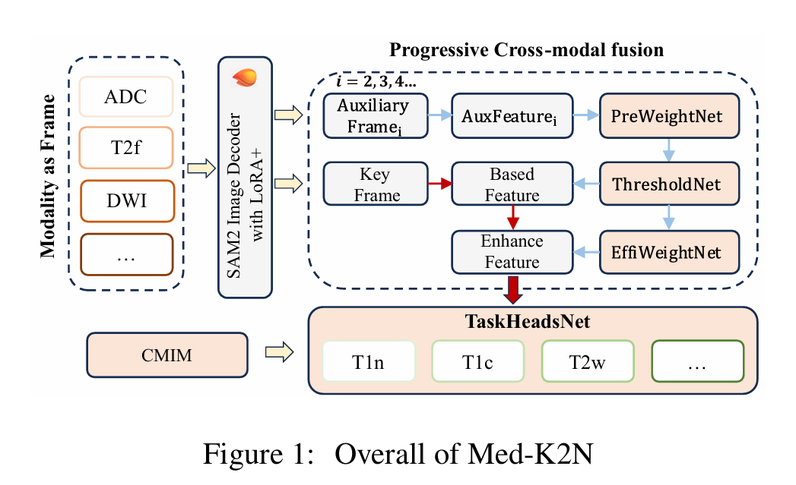
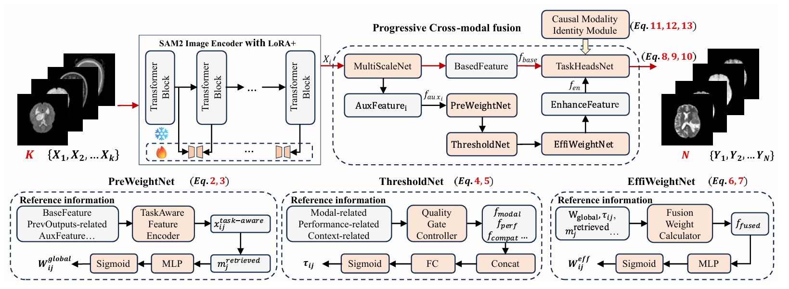
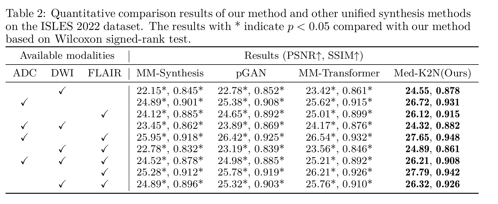
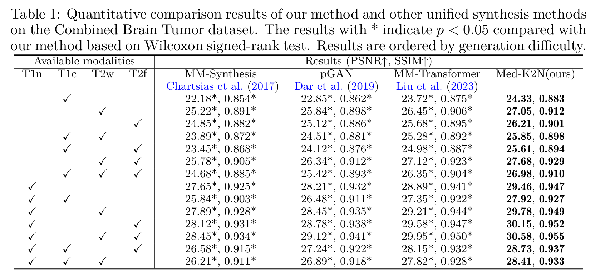
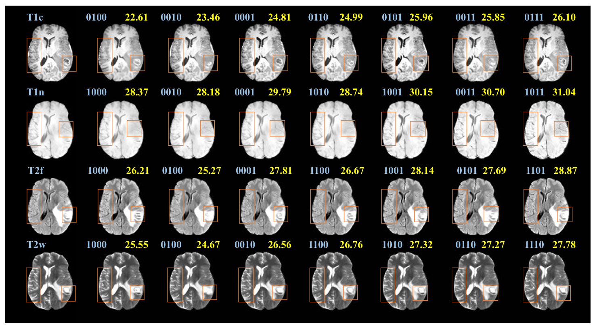

# Med-K2N: K→N Cross-Modal Medical Image Synthesis with Quality-Driven Sequential Fusion

**Under Review**

---

## 📖 Abstract

Cross-modal medical image synthesis research focuses on reconstructing missing imaging modalities from available ones to support clinical diagnosis. Driven by clinical necessities for flexible modality reconstruction, we explore **K→N medical generation**, where three critical challenges emerge: 

🔥 **Key Research Questions:**
1. ❓ **How can we model the heterogeneous contributions of different modalities to various target tasks?**
2. ❓ **How can we ensure fusion quality control to prevent degradation from noisy information?** 
3. ❓ **How can we maintain modality identity consistency in multi-output generation?**

Driven by these clinical necessities, and drawing inspiration from **SAM2's sequential frame paradigm** and **clinicians' progressive workflow** of incrementally adding and selectively integrating multi-modal information, we treat multi-modal medical data as sequential frames with quality-driven selection mechanisms. 

Our key idea is to **"learn"** adaptive weights for each modality-task pair and **"memorize"** beneficial fusion patterns through progressive enhancement. We design three collaborative modules: **PreWeightNet** for global contribution assessment, **ThresholdNet** for adaptive filtering, and **EffiWeightNet** for effective weight computation. Meanwhile, to maintain modality identity consistency, we propose the **Causal Modality Identity Module (CMIM)** that establishes causal constraints between generated images and target modality descriptions using vision-language modeling.




## 🏗️ Framework



Our Med-K2N framework incorporates the following core components inspired by clinicians' progressive workflow:

### Core Modules:

- **PreWeightNet**: Global contribution assessment network for modeling heterogeneous modality contributions to different target tasks
- **ThresholdNet**: Adaptive filtering network for quality control to prevent degradation from noisy information  
- **EffiWeightNet**: Effective weight computation network for optimal fusion weight calculation

- **TaskHeadNet**: Task-specific head network for final generation predictions


### Novel Components:

- **Causal Modality Identity Module (CMIM)**: Maintains modality identity consistency in multi-output generation using vision-language modeling with causal constraints

## 📁 Code Structure

The core model components use the same code structure as standard SAM2, located in `semseg/models/sam2`. We cloned these files from the official SAM repository. The Med-K2N model code is mainly in `semseg/models/sam2/sam2/sam_lora_image_encoder_seg.py`, with models named as the `MedK2N` series. In `train.py`, we import and train these models.

```
├── semseg/
│   ├── models/
│   │   └── sam2/                    # SAM2 base model
│   │       └── sam2/
│   │           └── Med-K2N.py  # Med-K2N core implementation
│   ├── datasets/
│   │   └── medicalmri.py           # Medical MRI dataset loader
│   ├── losses/
│   │   └── medical_modality_clip_loss.py  # Medical modality CLIP loss
│   └── utils/
├── Figure/                         # Project figures
├── tools/                          # Utility scripts
├── train.py                        # Training script
├── infer_k2n.py                   # Inference script for K→N generation
└── requirements.txt                # Dependencies
```

## 🛠️ Preparation

### Environment Setup

1. **Create and activate Conda environment:**
```bash
conda create -n medk2n python=3.10
conda activate medk2n
```

2. **Download SAM2 weights and upload to checkpoints directory:**
Download weights from [Facebook Research SAM2 Repository](https://github.com/facebookresearch/sam2) and place them in the `semseg/models/sam2/checkpoints` directory.

3. **Install PyTorch and related libraries:**
```bash
pip install torch==2.3.1 torchvision==0.18.1 torchaudio==2.3.1 --index-url https://download.pytorch.org/whl/cu121
```

4. **Install additional dependencies:**
```bash
pip install -r requirements.txt
```

5. **Install SAM2 model:**
```bash
cd semseg/models/sam2
pip install -e .
```

## 🏃 Run

### Data Preparation

1. **Download medical MRI datasets** and place them in the `data/` directory.

### Model Training

2. **Execute training command:**
```bash
python train.py --config configs/your_config.yaml
```

### K→N Medical Generation

3. **Execute K→N inference command:**
```bash
python infer_k2n.py --model-path path/to/your/model.pth --input-dir data/test --output-dir results/ --k-modalities T1,T2 --n-targets T1,T2,FLAIR,DWI
```

### 🚨 Important Notes

- Ensure the modality count in `semseg/models/sam2/sam2/sam_lora_image_encoder_seg.py` line 233 matches your dataset
- Verify sufficient GPU memory before training
- Multi-GPU training is recommended for faster convergence
- The model supports flexible K→N generation (e.g., 2→4, 1→3, 3→2, etc.)

## 📊 Experimental Results

We validate Med-K2N's performance on the ISLES 2022 dataset with various K→N generation tasks. The results show significant improvements over state-of-the-art methods.

### Quantitative Results on ISLES 2022 Dataset



**Table 2**: Quantitative comparison results of our method and other unified synthesis methods on the ISLES 2022 dataset. The results with * indicate p < 0.05 compared with our method based on Wilcoxon signed-rank test.

### Key Performance Highlights

- 🏆 **Consistent Superior Performance**: Med-K2N outperforms all baseline methods across all K→N generation tasks
- 📈 **Statistical Significance**: All baseline methods show p < 0.05 in Wilcoxon signed-rank test compared to our method
- 🎯 **Best Single-to-Multiple**: Achieves **27.79 PSNR, 0.942 SSIM** for FLAIR → ADC, DWI generation
- 🔥 **Best Multiple-to-Single**: Achieves **27.65 PSNR, 0.948 SSIM** for ADC, FLAIR → DWI generation
- ⚖️ **Balanced Performance**: Maintains high quality across different modality combinations

### Additional Results



### Qualitative Results



## 🎯 Key Features

- ✅ **Flexible K→N Generation**: Supports arbitrary input-to-output modality combinations (1→3, 2→4, etc.)
- ✅ **Quality-Driven Fusion**: Advanced quality control mechanisms prevent degradation from noisy information
- ✅ **Modality Identity Consistency**: CMIM ensures consistent modality characteristics across multi-output generation
- ✅ **Progressive Enhancement**: Sequential frame paradigm inspired by SAM2 and clinical workflow
- ✅ **Adaptive Weight Learning**: Heterogeneous modality contribution modeling for different target tasks
- ✅ **Vision-Language Integration**: Causal constraints using vision-language modeling for identity preservation

## 🤝 Acknowledgements

🤝 Our work builds upon the following excellent projects. Thanks for their contributions to the community:
- [SAM2](https://github.com/facebookresearch/sam2) - Segment Anything Model 2 for sequential frame paradigm inspiration
- [MemorySAM](https://github.com/Chenfei-Liao/MemorySAM) - Multi-modal memory segmentation


## 📄 License

This project is licensed under the [MIT License](LICENSE).


